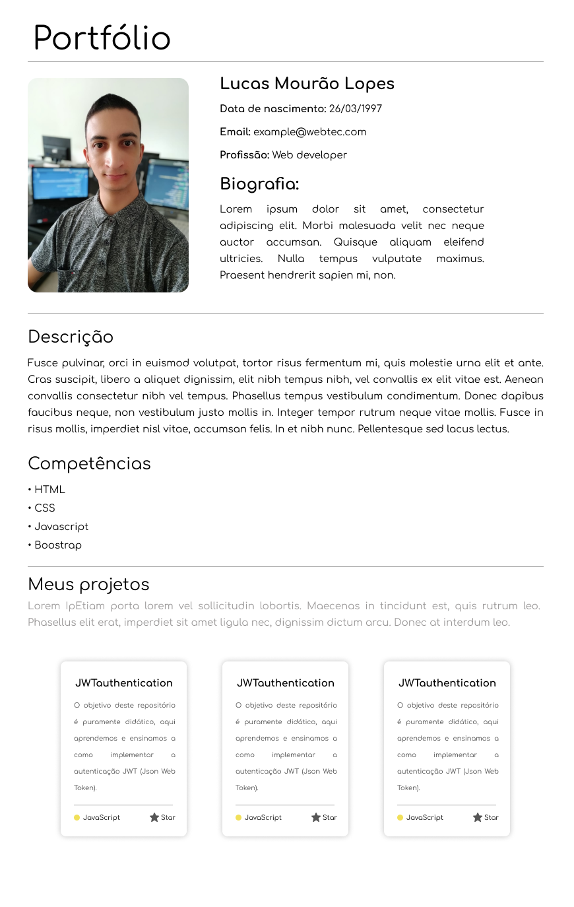

# Projeto da turma básica do 1º semestre de 2020

Esse projeto é um portfólio estático, o objetivo é introduzir as técnologias:

- **HTML5**
- **CSS3**
- **JS ES8**

E ao mesmo tempo levar os alunos a construírem algo que seja útil para sua carreira.

### Design

